# OMEGA-MBP-INDEX — Master Manifest for THEMANBEARPIG

> **Tier Ω — OMEGA**: The single source of truth for the entire 25-skill THEMANBEARPIG ecosystem.
> This file orchestrates skill selection, build sequencing, quality enforcement, and deployment
> readiness across 7 tiers and 24 domain skills. When in doubt, consult OMEGA.

---

## 1. Complete Skill Registry

### 1.1 Ecosystem Summary

| Metric | Value |
|--------|-------|
| Total skills | 24 domain + 1 OMEGA = 25 |
| Tiers | 7 (GENESIS → TRANSCENDENCE) |
| Total size | ~910 KB across all SKILL.md files |
| Total lines | ~18,000+ lines of actionable guidance |
| Target platform | Windows (AMD Ryzen 3 3200G, 24GB RAM, Vega 8 iGPU) |
| Rendering stack | D3.js + SVG/Canvas/WebGL, pywebview desktop shell |
| Data sources | litigation_context.db (790+ tables, ~1.3 GB) |

### 1.2 Tier 0 — GENESIS (Architectural DNA)

#### SINGULARITY-MBP-GENESIS
- **Path:** `.agents/skills/SINGULARITY-MBP-GENESIS/SKILL.md`
- **Size:** ~78 KB
- **Domain:** Graph architecture, node/link taxonomy, layer ontology
- **Capabilities:**
  - Defines 20+ node types (person, judge, case, evidence, authority, filing, etc.)
  - Defines 17 link types (accused_by, filed_in, ruled_by, cites, contradicts, etc.)
  - Specifies 13-layer architecture (Layer 0–12) with LAYER_META force configuration
  - Node sizing by evidence weight, coloring by lane assignment
  - Performance constraints: 2500+ nodes with viewport culling and LOD
- **Dependencies:** None (foundation layer)
- **Depends-on-me:** ALL other 23 skills

#### SINGULARITY-MBP-DATAWEAVE
- **Path:** `.agents/skills/SINGULARITY-MBP-DATAWEAVE/SKILL.md`
- **Size:** ~84 KB
- **Domain:** Data pipeline, DB→graph transforms, multi-backend data fabric
- **Capabilities:**
  - 183-table extraction pipeline from litigation_context.db
  - DuckDB analytical transforms (10-100× over SQLite for aggregations)
  - LanceDB vector enrichment (75K semantic vectors, 384-dim)
  - FTS5 BM25 relevance scoring for node/link weighting
  - Polars DataFrames for intermediate data shaping
- **Dependencies:** MBP-GENESIS (schema definitions)
- **Depends-on-me:** All COMBAT, INTEGRATION, and EMERGENCE skills

### 1.3 Tier 1 — FORGE (Rendering Engine)

#### SINGULARITY-MBP-FORGE-RENDERER
- **Path:** `.agents/skills/SINGULARITY-MBP-FORGE-RENDERER/SKILL.md`
- **Size:** ~25 KB
- **Domain:** SVG/Canvas/WebGL rendering, LOD, viewport culling
- **Capabilities:**
  - Multi-backend rendering: SVG for <500 nodes, Canvas for 500-2000, WebGL for 2000+
  - Quadtree spatial indexing for O(log n) viewport culling
  - Level-of-detail (LOD) rendering: full detail → simplified → dots by zoom level
  - Dynamic resolution scaling based on frame rate monitoring
  - GPU-accelerated text rendering via Canvas 2D offscreen
- **Dependencies:** MBP-GENESIS (node/link types), MBP-DATAWEAVE (graph data)
- **Depends-on-me:** MBP-FORGE-EFFECTS, MBP-FORGE-DEPLOY

#### SINGULARITY-MBP-FORGE-PHYSICS
- **Path:** `.agents/skills/SINGULARITY-MBP-FORGE-PHYSICS/SKILL.md`
- **Size:** ~59 KB
- **Domain:** Force simulation, custom forces, collision, layout algorithms
- **Capabilities:**
  - D3-force simulation with per-layer LAYER_META tuning
  - Barnes-Hut approximation (θ=0.9) for O(n log n) charge calculation
  - Custom forces: orbital (ring layout per layer), lane-gravity, temporal-x
  - Collision detection with variable-radius nodes
  - Layout presets: force-directed, radial, hierarchical, timeline, cluster
- **Dependencies:** MBP-GENESIS (LAYER_META config)
- **Depends-on-me:** MBP-FORGE-RENDERER, MBP-EMERGENCE-SELFEVOLVE

#### SINGULARITY-MBP-FORGE-EFFECTS
- **Path:** `.agents/skills/SINGULARITY-MBP-FORGE-EFFECTS/SKILL.md`
- **Size:** ~25 KB
- **Domain:** Shaders, GLSL, particles, visual effects
- **Capabilities:**
  - GLSL fragment shaders for node glow, edge pulse, threat auras
  - Particle systems for evidence discovery animations
  - Post-processing: bloom, CRT scanlines, vignette, chromatic aberration
  - Glass/frosted panel effects for HUD overlays
  - Fog-of-war for undiscovered evidence regions
- **Dependencies:** MBP-FORGE-RENDERER (WebGL context)
- **Depends-on-me:** MBP-INTERFACE-HUD, MBP-TRANSCENDENCE-DIMENSIONAL

#### SINGULARITY-MBP-FORGE-DEPLOY
- **Path:** `.agents/skills/SINGULARITY-MBP-FORGE-DEPLOY/SKILL.md`
- **Size:** ~13 KB
- **Domain:** EXE build, pywebview, PyInstaller, desktop packaging
- **Capabilities:**
  - pywebview desktop shell with Python↔JS bridge
  - PyInstaller one-file EXE bundling with D3.js inlined
  - Icon generation from litigation graph snapshots
  - Auto-updater with semantic versioning
  - NSIS installer with Start Menu shortcuts
- **Dependencies:** MBP-FORGE-RENDERER, MBP-FORGE-EFFECTS (complete rendering pipeline)
- **Depends-on-me:** None (terminal deployment node)

### 1.4 Tier 2 — COMBAT (Domain Overlays)

#### SINGULARITY-MBP-COMBAT-ADVERSARY
- **Path:** `.agents/skills/SINGULARITY-MBP-COMBAT-ADVERSARY/SKILL.md`
- **Size:** ~30 KB
- **Domain:** Adversary network analysis
- **Capabilities:**
  - PageRank scoring for adversary influence measurement
  - Betweenness/closeness centrality for network gatekeepers
  - Louvain community detection for hidden faction clusters
  - Ego-network extraction per adversary with 1-hop and 2-hop views
  - Threat scoring composite: harm_count × centrality × recency
- **Dependencies:** MBP-GENESIS, MBP-DATAWEAVE
- **Depends-on-me:** MBP-COMBAT-JUDICIAL, MBP-EMERGENCE-PREDICTION

#### SINGULARITY-MBP-COMBAT-WEAPONS
- **Path:** `.agents/skills/SINGULARITY-MBP-COMBAT-WEAPONS/SKILL.md`
- **Size:** ~32 KB
- **Domain:** Weapon chain visualization (9 weapon types)
- **Capabilities:**
  - 9 weapon types: false_allegation, ex_parte, PPO_weaponization, contempt, evidence_exclusion, FOC_bias, medication_coercion, incarceration, parental_alienation
  - Doctrine→remedy→filing chain mapping per weapon
  - Weapon activation timeline with escalation indicators
  - Counter-weapon strategy nodes linked to filing packages
  - Weapon frequency heatmap by time period
- **Dependencies:** MBP-GENESIS, MBP-DATAWEAVE, MBP-COMBAT-ADVERSARY
- **Depends-on-me:** MBP-INTEGRATION-FILING

#### SINGULARITY-MBP-COMBAT-JUDICIAL
- **Path:** `.agents/skills/SINGULARITY-MBP-COMBAT-JUDICIAL/SKILL.md`
- **Size:** ~32 KB
- **Domain:** Judicial cartel visualization
- **Capabilities:**
  - McNeill-Hoopes-Ladas triangle rendering with connection evidence
  - Violation heatmap: 5,059 violations by type and date
  - Ex parte order timeline with Albert premeditation linkage
  - JTC exhibit mapping to violation categories
  - Cavan Berry connection overlay (spouse→judge→FOC address)
- **Dependencies:** MBP-GENESIS, MBP-DATAWEAVE, MBP-COMBAT-ADVERSARY
- **Depends-on-me:** MBP-INTERFACE-HUD, MBP-EMERGENCE-CONVERGENCE

#### SINGULARITY-MBP-COMBAT-EVIDENCE
- **Path:** `.agents/skills/SINGULARITY-MBP-COMBAT-EVIDENCE/SKILL.md`
- **Size:** ~31 KB
- **Domain:** Evidence density and gap analysis
- **Capabilities:**
  - Evidence heat density overlay per lane and factor
  - Semantic clustering via t-SNE projection of 75K evidence vectors
  - Gap detection: areas with claims but no supporting evidence
  - Evidence strength scoring (source reliability × corroboration count)
  - Exhibit-to-node binding with Bates number references
- **Dependencies:** MBP-GENESIS, MBP-DATAWEAVE
- **Depends-on-me:** MBP-COMBAT-IMPEACHMENT, MBP-EMERGENCE-CONVERGENCE

#### SINGULARITY-MBP-COMBAT-AUTHORITY
- **Path:** `.agents/skills/SINGULARITY-MBP-COMBAT-AUTHORITY/SKILL.md`
- **Size:** ~35 KB
- **Domain:** Legal authority hierarchy
- **Capabilities:**
  - Authority hierarchy tree: SCOTUS → 6th Circuit → MSC → COA → Circuit
  - Citation PageRank for most-cited authorities
  - Chain completeness scoring (claim→authority→supporting_authority)
  - Shepardization signal overlay (good law, questioned, overruled)
  - Authority-to-filing mapping (which filings cite which authorities)
- **Dependencies:** MBP-GENESIS, MBP-DATAWEAVE
- **Depends-on-me:** MBP-INTEGRATION-FILING

#### SINGULARITY-MBP-COMBAT-IMPEACHMENT
- **Path:** `.agents/skills/SINGULARITY-MBP-COMBAT-IMPEACHMENT/SKILL.md`
- **Size:** ~33 KB
- **Domain:** Impeachment and credibility analysis
- **Capabilities:**
  - Impeachment scoring per witness (1-10 scale, composite of contradictions)
  - Credibility chain rendering: claim → prior statement → contradiction → exhibit
  - MRE 613 prior inconsistent statement workflow visualization
  - Cross-examination question generation linked to evidence nodes
  - Contradiction severity heatmap across timeline
- **Dependencies:** MBP-GENESIS, MBP-DATAWEAVE, MBP-COMBAT-EVIDENCE
- **Depends-on-me:** MBP-INTERFACE-NARRATIVE

### 1.5 Tier 3 — INTERFACE (User Interaction)

#### SINGULARITY-MBP-INTERFACE-CONTROLS
- **Path:** `.agents/skills/SINGULARITY-MBP-INTERFACE-CONTROLS/SKILL.md`
- **Size:** ~35 KB
- **Domain:** Click, search, filter, keyboard, export interactions
- **Capabilities:**
  - Click handlers: select, multi-select, drag, context menu per node type
  - Fuse.js fuzzy search across all node labels and metadata
  - Filter panel: by layer, lane, date range, evidence strength, actor
  - Keyboard shortcuts: layer toggle, zoom, pan, search focus, export
  - Export: PNG snapshot, SVG vector, JSON graph data, CSV node list
- **Dependencies:** MBP-FORGE-RENDERER, MBP-FORGE-PHYSICS
- **Depends-on-me:** MBP-INTERFACE-NARRATIVE

#### SINGULARITY-MBP-INTERFACE-TIMELINE
- **Path:** `.agents/skills/SINGULARITY-MBP-INTERFACE-TIMELINE/SKILL.md`
- **Size:** ~37 KB
- **Domain:** Temporal navigation and playback
- **Capabilities:**
  - Timeline scrubber bar with date range selection
  - Temporal playback: animate graph evolution over time
  - Keyframe markers for critical events (trial, ex parte orders, separation)
  - Milestone overlay with configurable event types
  - Temporal filtering: show only nodes/links active in selected date range
- **Dependencies:** MBP-FORGE-RENDERER, MBP-FORGE-PHYSICS, MBP-DATAWEAVE
- **Depends-on-me:** MBP-INTERFACE-NARRATIVE, MBP-TRANSCENDENCE-SONIC

#### SINGULARITY-MBP-INTERFACE-NARRATIVE
- **Path:** `.agents/skills/SINGULARITY-MBP-INTERFACE-NARRATIVE/SKILL.md`
- **Size:** ~23 KB
- **Domain:** Story mode and guided exploration
- **Capabilities:**
  - Story mode walkthroughs: guided paths through the graph
  - Narrative generation from graph traversal patterns
  - Jury presentation mode: simplified, annotated views
  - Breadcrumb trail for exploration history
  - Annotation layer for user-added notes on nodes
- **Dependencies:** MBP-INTERFACE-CONTROLS, MBP-INTERFACE-TIMELINE, MBP-COMBAT-IMPEACHMENT
- **Depends-on-me:** None

#### SINGULARITY-MBP-INTERFACE-HUD
- **Path:** `.agents/skills/SINGULARITY-MBP-INTERFACE-HUD/SKILL.md`
- **Size:** ~28 KB
- **Domain:** Heads-up display, gauges, minimap
- **Capabilities:**
  - EGCP (Evidence-Grade Confidence Percentage) gauge per filing lane
  - Filing readiness meters for F1-F10 with gap indicators
  - Minimap showing full graph with viewport rectangle
  - FPS counter and performance alerts
  - Separation day counter (dynamic since Jul 29, 2025)
- **Dependencies:** MBP-FORGE-RENDERER, MBP-FORGE-EFFECTS, MBP-COMBAT-JUDICIAL
- **Depends-on-me:** None

### 1.6 Tier 4 — INTEGRATION (Engine Bridges)

#### SINGULARITY-MBP-INTEGRATION-ENGINES
- **Path:** `.agents/skills/SINGULARITY-MBP-INTEGRATION-ENGINES/SKILL.md`
- **Size:** ~39 KB
- **Domain:** 14-engine bridge system
- **Capabilities:**
  - Bridge to all 14 LitigationOS engines (nexus, chimera, chronos, etc.)
  - MEEK lane classification overlay from ingest engine
  - Delta999 agent activity overlay (8 specialized agents)
  - Engine health status nodes with heartbeat monitoring
  - Real-time data refresh from engine outputs
- **Dependencies:** MBP-GENESIS, MBP-DATAWEAVE
- **Depends-on-me:** MBP-INTEGRATION-FILING, MBP-INTEGRATION-BRAINS

#### SINGULARITY-MBP-INTEGRATION-FILING
- **Path:** `.agents/skills/SINGULARITY-MBP-INTEGRATION-FILING/SKILL.md`
- **Size:** ~46 KB
- **Domain:** Filing pipeline visualization
- **Capabilities:**
  - Filing pipeline F1-F10 as Kanban board overlay
  - EGCP confidence bars per filing with drill-down
  - Deadline countdown nodes with urgency color coding
  - Filing packet composition view (motion + brief + exhibits + COS)
  - Filing dependency graph (which filings block others)
- **Dependencies:** MBP-DATAWEAVE, MBP-COMBAT-WEAPONS, MBP-COMBAT-AUTHORITY, MBP-INTEGRATION-ENGINES
- **Depends-on-me:** MBP-INTERFACE-HUD

#### SINGULARITY-MBP-INTEGRATION-BRAINS
- **Path:** `.agents/skills/SINGULARITY-MBP-INTEGRATION-BRAINS/SKILL.md`
- **Size:** ~55 KB
- **Domain:** Brain network visualization
- **Capabilities:**
  - 23+ brain database nodes with size/health indicators
  - Inter-brain data flow arrows showing knowledge transfer
  - Brain learning loops (feedback cycles between brains)
  - Brain health monitoring (staleness, growth rate, error rate)
  - Version history timeline per brain
- **Dependencies:** MBP-DATAWEAVE, MBP-INTEGRATION-ENGINES
- **Depends-on-me:** MBP-EMERGENCE-SELFEVOLVE

### 1.7 Tier 5 — EMERGENCE (Self-Improvement)

#### SINGULARITY-MBP-EMERGENCE-CONVERGENCE
- **Path:** `.agents/skills/SINGULARITY-MBP-EMERGENCE-CONVERGENCE/SKILL.md`
- **Size:** ~13 KB
- **Domain:** Cross-layer intelligence and pattern detection
- **Capabilities:**
  - DBSCAN clustering across graph layers for hidden connections
  - Emergence signal detection: novelty scoring for new patterns
  - Convergence metrics: lane readiness, evidence completeness
  - Gap-to-acquisition task generation from detected gaps
  - Build-to-build delta tracking for self-improvement metrics
- **Dependencies:** MBP-COMBAT-JUDICIAL, MBP-COMBAT-EVIDENCE, MBP-DATAWEAVE
- **Depends-on-me:** MBP-EMERGENCE-PREDICTION

#### SINGULARITY-MBP-EMERGENCE-PREDICTION
- **Path:** `.agents/skills/SINGULARITY-MBP-EMERGENCE-PREDICTION/SKILL.md`
- **Size:** ~11 KB
- **Domain:** Adversary behavior forecasting
- **Capabilities:**
  - Temporal pattern analysis from adversary action history
  - Retaliation timing prediction based on filing-to-response intervals
  - Escalation slope computation (are things getting worse?)
  - Counter-strategy pre-generation for predicted adversary moves
  - Early warning system with configurable alert thresholds
- **Dependencies:** MBP-COMBAT-ADVERSARY, MBP-EMERGENCE-CONVERGENCE
- **Depends-on-me:** MBP-INTERFACE-HUD (alerts)

#### SINGULARITY-MBP-EMERGENCE-SELFEVOLVE
- **Path:** `.agents/skills/SINGULARITY-MBP-EMERGENCE-SELFEVOLVE/SKILL.md`
- **Size:** ~11 KB
- **Domain:** Self-improving layout and configuration
- **Capabilities:**
  - Auto-optimize force simulation parameters from user interaction telemetry
  - Learned configuration preferences persisted in localStorage
  - Plugin architecture for third-party visualization extensions
  - Build versioning with semantic version tracking
  - A/B layout comparison for parameter tuning
- **Dependencies:** MBP-FORGE-PHYSICS, MBP-INTEGRATION-BRAINS
- **Depends-on-me:** None

### 1.8 Tier 6 — TRANSCENDENCE (Beyond 2D)

#### SINGULARITY-MBP-TRANSCENDENCE-SONIC
- **Path:** `.agents/skills/SINGULARITY-MBP-TRANSCENDENCE-SONIC/SKILL.md`
- **Size:** ~54 KB
- **Domain:** Audio sonification
- **Capabilities:**
  - Threat-to-pitch mapping: higher threat = higher frequency
  - Ambient soundscape reflecting overall case health
  - Web Audio API oscillators, filters, and spatial audio
  - Audio cues for navigation events (select, filter, discover)
  - Accessibility: audio indicators complement visual signals
- **Dependencies:** MBP-INTERFACE-TIMELINE (temporal sync), MBP-FORGE-RENDERER
- **Depends-on-me:** None

#### SINGULARITY-MBP-TRANSCENDENCE-DIMENSIONAL
- **Path:** `.agents/skills/SINGULARITY-MBP-TRANSCENDENCE-DIMENSIONAL/SKILL.md`
- **Size:** ~69 KB
- **Domain:** 3D graph and VR
- **Capabilities:**
  - Three.js 3D graph rendering with orbit controls
  - WebXR VR mode for immersive graph exploration
  - t-SNE / UMAP dimensionality reduction for 3D embedding layout
  - Stereoscopic rendering for VR headsets
  - Parallax depth effect for 2.5D non-VR viewing
- **Dependencies:** MBP-FORGE-RENDERER, MBP-FORGE-EFFECTS, MBP-FORGE-PHYSICS
- **Depends-on-me:** None

---

## 2. Activation Matrix

### 2.1 Single-Task Activation

| Task Pattern | Primary Skill | Secondary Skills |
|-------------|---------------|------------------|
| Define node/link types | MBP-GENESIS | — |
| Build data pipeline | MBP-DATAWEAVE | MBP-GENESIS |
| Render the graph | MBP-FORGE-RENDERER | MBP-GENESIS, MBP-FORGE-PHYSICS |
| Tune force layout | MBP-FORGE-PHYSICS | MBP-GENESIS |
| Add visual effects | MBP-FORGE-EFFECTS | MBP-FORGE-RENDERER |
| Package as EXE | MBP-FORGE-DEPLOY | MBP-FORGE-RENDERER, MBP-FORGE-EFFECTS |
| Analyze adversary network | MBP-COMBAT-ADVERSARY | MBP-DATAWEAVE |
| Map weapon chains | MBP-COMBAT-WEAPONS | MBP-COMBAT-ADVERSARY, MBP-DATAWEAVE |
| Show judicial cartel | MBP-COMBAT-JUDICIAL | MBP-COMBAT-ADVERSARY |
| Visualize evidence gaps | MBP-COMBAT-EVIDENCE | MBP-DATAWEAVE |
| Build authority tree | MBP-COMBAT-AUTHORITY | MBP-DATAWEAVE |
| Score impeachment | MBP-COMBAT-IMPEACHMENT | MBP-COMBAT-EVIDENCE |
| Add search/filter | MBP-INTERFACE-CONTROLS | MBP-FORGE-RENDERER |
| Build timeline scrubber | MBP-INTERFACE-TIMELINE | MBP-FORGE-RENDERER, MBP-DATAWEAVE |
| Create story mode | MBP-INTERFACE-NARRATIVE | MBP-INTERFACE-CONTROLS, MBP-INTERFACE-TIMELINE |
| Design HUD overlay | MBP-INTERFACE-HUD | MBP-FORGE-EFFECTS |
| Bridge to engines | MBP-INTEGRATION-ENGINES | MBP-DATAWEAVE |
| Show filing pipeline | MBP-INTEGRATION-FILING | MBP-INTEGRATION-ENGINES |
| Map brain network | MBP-INTEGRATION-BRAINS | MBP-INTEGRATION-ENGINES |
| Detect hidden patterns | MBP-EMERGENCE-CONVERGENCE | MBP-COMBAT-EVIDENCE, MBP-COMBAT-JUDICIAL |
| Predict adversary moves | MBP-EMERGENCE-PREDICTION | MBP-COMBAT-ADVERSARY, MBP-EMERGENCE-CONVERGENCE |
| Auto-tune layout | MBP-EMERGENCE-SELFEVOLVE | MBP-FORGE-PHYSICS |
| Add audio sonification | MBP-TRANSCENDENCE-SONIC | MBP-INTERFACE-TIMELINE |
| Enable 3D/VR mode | MBP-TRANSCENDENCE-DIMENSIONAL | MBP-FORGE-RENDERER, MBP-FORGE-PHYSICS |

### 2.2 Multi-Skill Activation Patterns (Complex Tasks)

| Task Pattern | Skills Activated | Phase Order |
|-------------|------------------|-------------|
| **Upgrade THEMANBEARPIG visualization** | GENESIS + DATAWEAVE + FORGE-RENDERER + FORGE-PHYSICS + FORGE-DEPLOY | 1→2→3→3→4 |
| **Add new adversary connections** | DATAWEAVE + COMBAT-ADVERSARY + FORGE-PHYSICS + FORGE-RENDERER | 2→4→3→3 |
| **Build judicial cartel overlay** | COMBAT-JUDICIAL + COMBAT-ADVERSARY + INTERFACE-HUD + FORGE-EFFECTS | 4→4→5→3 |
| **Create weapon chain visualization** | COMBAT-WEAPONS + COMBAT-EVIDENCE + INTEGRATION-FILING + FORGE-RENDERER | 4→4→6→3 |
| **Add timeline playback** | INTERFACE-TIMELINE + TRANSCENDENCE-SONIC + FORGE-EFFECTS + FORGE-RENDERER | 5→8→3→3 |
| **Enable VR mode** | TRANSCENDENCE-DIMENSIONAL + FORGE-RENDERER + FORGE-PHYSICS + FORGE-EFFECTS | 8→3→3→3 |
| **Detect new patterns** | EMERGENCE-CONVERGENCE + EMERGENCE-PREDICTION + COMBAT-EVIDENCE + DATAWEAVE | 7→7→4→2 |
| **Export impeachment package** | COMBAT-IMPEACHMENT + INTERFACE-NARRATIVE + INTEGRATION-FILING + INTERFACE-CONTROLS | 4→5→6→5 |
| **Full rebuild with all data** | ALL 24 SKILLS via OMEGA orchestration | Phases 1-8 |
| **Optimize rendering performance** | FORGE-RENDERER + FORGE-PHYSICS + FORGE-EFFECTS + EMERGENCE-SELFEVOLVE | 3→3→3→7 |
| **Add evidence clustering** | COMBAT-EVIDENCE + DATAWEAVE + FORGE-RENDERER + INTERFACE-CONTROLS | 4→2→3→5 |
| **Build filing readiness dashboard** | INTEGRATION-FILING + INTERFACE-HUD + COMBAT-AUTHORITY + COMBAT-EVIDENCE | 6→5→4→4 |
| **Create jury presentation** | INTERFACE-NARRATIVE + INTERFACE-TIMELINE + COMBAT-IMPEACHMENT + FORGE-EFFECTS | 5→5→4→3 |
| **Integrate new engine** | INTEGRATION-ENGINES + DATAWEAVE + GENESIS + FORGE-RENDERER | 6→2→1→3 |
| **Add brain health monitoring** | INTEGRATION-BRAINS + INTERFACE-HUD + EMERGENCE-SELFEVOLVE | 6→5→7 |
| **Build authority citation graph** | COMBAT-AUTHORITY + DATAWEAVE + FORGE-PHYSICS + INTERFACE-CONTROLS | 4→2→3→5 |
| **Track adversary escalation** | EMERGENCE-PREDICTION + COMBAT-ADVERSARY + INTERFACE-TIMELINE + INTERFACE-HUD | 7→4→5→5 |
| **Add ambient audio** | TRANSCENDENCE-SONIC + INTERFACE-TIMELINE + FORGE-EFFECTS | 8→5→3 |
| **Profile-based node coloring** | GENESIS + FORGE-RENDERER + COMBAT-ADVERSARY | 1→3→4 |
| **Full convergence audit** | EMERGENCE-CONVERGENCE + DATAWEAVE + COMBAT-EVIDENCE + COMBAT-AUTHORITY + INTEGRATION-FILING | 7→2→4→4→6 |
| **Build separation counter HUD** | INTERFACE-HUD + DATAWEAVE + FORGE-EFFECTS | 5→2→3 |
| **Deploy production EXE** | FORGE-DEPLOY + FORGE-RENDERER + FORGE-EFFECTS + ALL COMBAT + ALL INTERFACE | 3→3→3→4→5 |

---

## 3. Build Pipeline Orchestration

### 3.1 Full Build Phases

When building THEMANBEARPIG from scratch, execute skills in this strict phase order.
Each phase must PASS its quality gate before advancing to the next.

```
╔══════════════════════════════════════════════════════════════════════╗
║  THEMANBEARPIG — 8-Phase Build Pipeline                            ║
║                                                                      ║
║  Phase 1: GENESIS ──────────► Schema validated                      ║
║     └─ MBP-GENESIS              All 13 layers defined               ║
║                                  20+ node types, 17 link types       ║
║                                                                      ║
║  Phase 2: DATA ─────────────► Data pipeline functional              ║
║     └─ MBP-DATAWEAVE            183-table extraction verified        ║
║                                  Graph JSON emitted                   ║
║                                                                      ║
║  Phase 3: RENDERING ────────► Visual output verified                ║
║     ├─ MBP-FORGE-PHYSICS        Force simulation converges           ║
║     ├─ MBP-FORGE-RENDERER       2500+ nodes render at 30fps         ║
║     └─ MBP-FORGE-EFFECTS        Effects don't drop below 24fps      ║
║                                                                      ║
║  Phase 4: COMBAT ───────────► All 6 overlays functional             ║
║     ├─ MBP-COMBAT-ADVERSARY     PageRank computed                    ║
║     ├─ MBP-COMBAT-WEAPONS       9 weapon types mapped                ║
║     ├─ MBP-COMBAT-JUDICIAL      McNeill triangle rendered            ║
║     ├─ MBP-COMBAT-EVIDENCE      Gap detection running                ║
║     ├─ MBP-COMBAT-AUTHORITY     Citation hierarchy built             ║
║     └─ MBP-COMBAT-IMPEACHMENT   Credibility chains linked           ║
║                                                                      ║
║  Phase 5: INTERFACE ────────► All interactions responsive            ║
║     ├─ MBP-INTERFACE-CONTROLS   <100ms response on click/search     ║
║     ├─ MBP-INTERFACE-TIMELINE   Scrubber renders, playback works    ║
║     ├─ MBP-INTERFACE-NARRATIVE  Story mode walkthrough functional   ║
║     └─ MBP-INTERFACE-HUD        All gauges display correct data     ║
║                                                                      ║
║  Phase 6: INTEGRATION ─────► All bridges connected                  ║
║     ├─ MBP-INTEGRATION-ENGINES  14 engines respond to queries       ║
║     ├─ MBP-INTEGRATION-FILING   F1-F10 pipeline visualized          ║
║     └─ MBP-INTEGRATION-BRAINS   23+ brains mapped                   ║
║                                                                      ║
║  Phase 7: EMERGENCE ───────► Self-improvement active                ║
║     ├─ MBP-EMERGENCE-CONVERGENCE DBSCAN <200ms                     ║
║     ├─ MBP-EMERGENCE-PREDICTION  Forecasts generated                ║
║     └─ MBP-EMERGENCE-SELFEVOLVE  Config learning persists           ║
║                                                                      ║
║  Phase 8: TRANSCENDENCE ───► Audio + 3D verified                    ║
║     ├─ MBP-TRANSCENDENCE-SONIC   Audio plays without glitches      ║
║     └─ MBP-TRANSCENDENCE-DIMENSIONAL  3D renders at 30fps          ║
║                                                                      ║
║  DEPLOY: MBP-FORGE-DEPLOY ─► EXE built, tested, versioned          ║
╚══════════════════════════════════════════════════════════════════════╝
```

### 3.2 Build Orchestrator Script

```javascript
// build_mbp.js — THEMANBEARPIG full build orchestrator
const PHASES = [
  {
    id: 1, name: 'GENESIS',
    skills: ['MBP-GENESIS'],
    gate: (ctx) => ctx.layers === 13 && ctx.nodeTypes >= 20 && ctx.linkTypes >= 17,
    gateLabel: '13 layers, 20+ node types, 17+ link types'
  },
  {
    id: 2, name: 'DATA',
    skills: ['MBP-DATAWEAVE'],
    gate: (ctx) => ctx.nodesLoaded > 0 && ctx.linksLoaded > 0 && ctx.tablesQueried >= 10,
    gateLabel: 'Graph JSON emitted with nodes + links from 10+ tables'
  },
  {
    id: 3, name: 'RENDERING',
    skills: ['MBP-FORGE-PHYSICS', 'MBP-FORGE-RENDERER', 'MBP-FORGE-EFFECTS'],
    gate: (ctx) => ctx.fps >= 30 && ctx.effectsFps >= 24 && ctx.simulationConverged,
    gateLabel: '30fps base, 24fps with effects, simulation converged'
  },
  {
    id: 4, name: 'COMBAT',
    skills: [
      'MBP-COMBAT-ADVERSARY', 'MBP-COMBAT-WEAPONS', 'MBP-COMBAT-JUDICIAL',
      'MBP-COMBAT-EVIDENCE', 'MBP-COMBAT-AUTHORITY', 'MBP-COMBAT-IMPEACHMENT'
    ],
    gate: (ctx) => ctx.combatOverlays === 6 && ctx.pageRankComputed && ctx.gapDetectionRan,
    gateLabel: 'All 6 overlays active, PageRank + gap detection operational'
  },
  {
    id: 5, name: 'INTERFACE',
    skills: [
      'MBP-INTERFACE-CONTROLS', 'MBP-INTERFACE-TIMELINE',
      'MBP-INTERFACE-NARRATIVE', 'MBP-INTERFACE-HUD'
    ],
    gate: (ctx) => ctx.clickLatency < 100 && ctx.searchWorks && ctx.hudDisplays,
    gateLabel: '<100ms click, search functional, HUD gauges correct'
  },
  {
    id: 6, name: 'INTEGRATION',
    skills: [
      'MBP-INTEGRATION-ENGINES', 'MBP-INTEGRATION-FILING', 'MBP-INTEGRATION-BRAINS'
    ],
    gate: (ctx) => ctx.enginesBridged >= 14 && ctx.filingsVisualized && ctx.brainsMapped >= 23,
    gateLabel: '14 engines bridged, F1-F10 shown, 23+ brains mapped'
  },
  {
    id: 7, name: 'EMERGENCE',
    skills: [
      'MBP-EMERGENCE-CONVERGENCE', 'MBP-EMERGENCE-PREDICTION',
      'MBP-EMERGENCE-SELFEVOLVE'
    ],
    gate: (ctx) => ctx.dbscanMs < 200 && ctx.predictionGenerated && ctx.configPersists,
    gateLabel: 'DBSCAN <200ms, predictions generated, config persists'
  },
  {
    id: 8, name: 'TRANSCENDENCE',
    skills: ['MBP-TRANSCENDENCE-SONIC', 'MBP-TRANSCENDENCE-DIMENSIONAL'],
    gate: (ctx) => ctx.audioPlays && ctx.threeDFps >= 30,
    gateLabel: 'Audio glitch-free, 3D at 30fps'
  }
];

async function buildMBP() {
  const ctx = {};
  for (const phase of PHASES) {
    console.log(`\n=== Phase ${phase.id}: ${phase.name} ===`);
    console.log(`  Skills: ${phase.skills.join(', ')}`);

    for (const skill of phase.skills) {
      console.log(`  Executing: ${skill}...`);
      await executeSkill(skill, ctx);
    }

    if (!phase.gate(ctx)) {
      console.error(`  ❌ GATE FAILED: ${phase.gateLabel}`);
      console.error(`  Build halted at Phase ${phase.id}. Fix issues and retry.`);
      return false;
    }
    console.log(`  ✅ GATE PASSED: ${phase.gateLabel}`);
  }

  console.log('\n=== DEPLOY ===');
  await executeSkill('MBP-FORGE-DEPLOY', ctx);
  console.log('✅ THEMANBEARPIG build complete. EXE ready.');
  return true;
}
```

### 3.3 Incremental Build (Skip Phases)

For updates that only touch a subset of skills:

```javascript
// Incremental build — specify which phases to re-run
async function incrementalBuild(startPhase, endPhase) {
  const ctx = await loadPreviousBuildContext(); // from localStorage or build.json
  for (const phase of PHASES.filter(p => p.id >= startPhase && p.id <= endPhase)) {
    for (const skill of phase.skills) {
      await executeSkill(skill, ctx);
    }
    if (!phase.gate(ctx)) {
      throw new Error(`Gate failed at Phase ${phase.id}: ${phase.gateLabel}`);
    }
  }
  await saveBuildContext(ctx);
}

// Common incremental patterns:
// incrementalBuild(2, 2)  — data refresh only
// incrementalBuild(3, 3)  — rendering changes only
// incrementalBuild(4, 4)  — new combat overlay
// incrementalBuild(5, 5)  — UI changes only
// incrementalBuild(4, 6)  — new combat + interface + integration
```

---

## 4. Quality Gates per Tier

### 4.1 Gate Definitions

#### GENESIS Gate (Phase 1)

| Check | Requirement | Validation |
|-------|-------------|------------|
| Layer count | Exactly 13 layers (0–12) | `LAYER_META.length === 13` |
| Node types | ≥20 registered types | `NODE_TYPES.size >= 20` |
| Link types | ≥17 registered types | `LINK_TYPES.size >= 17` |
| LAYER_META | All layers have charge, distance, collision, color | No `undefined` values |
| Schema JSON | Valid JSON-LD graph schema | `JSON.parse()` succeeds, `@context` present |

#### FORGE Gate (Phase 3)

| Check | Requirement | Validation |
|-------|-------------|------------|
| Base FPS | ≥30fps with 2500 nodes | `performance.now()` frame timing over 60 frames |
| Effects FPS | ≥24fps with all effects enabled | Same measurement with effects on |
| LOD activation | LOD kicks in at correct zoom thresholds | Zoom to 0.3 → nodes simplified |
| Viewport culling | Off-screen nodes not rendered | Count draw calls vs visible nodes |
| Simulation convergence | Alpha < 0.001 within 300 ticks | `simulation.alpha() < 0.001` |
| Memory usage | <500MB JS heap with full graph | `performance.memory.usedJSHeapSize` |

```javascript
function runForgeGate(renderer, simulation) {
  const results = {
    baseFps: measureFPS(renderer, { effects: false, duration: 2000 }),
    effectsFps: measureFPS(renderer, { effects: true, duration: 2000 }),
    lodWorks: testLOD(renderer),
    cullingWorks: testViewportCulling(renderer),
    converges: simulation.alpha() < 0.001,
    memoryOk: performance.memory?.usedJSHeapSize < 500 * 1024 * 1024
  };
  results.passed = results.baseFps >= 30
    && results.effectsFps >= 24
    && results.lodWorks
    && results.cullingWorks
    && results.converges
    && results.memoryOk;
  return results;
}
```

#### COMBAT Gate (Phase 4)

| Check | Requirement | Validation |
|-------|-------------|------------|
| Adversary PageRank | Computed for all person nodes | No NaN values in pagerank scores |
| Weapon chains | All 9 weapon types mapped | `weaponTypes.length === 9` |
| Judicial triangle | McNeill-Hoopes-Ladas rendered | 3 nodes + 3 edges present |
| Evidence gaps | Gap detection returns results | `gaps.length > 0` or explicit "no gaps" |
| Authority tree | Hierarchy renders with ≥3 levels | SCOTUS → Circuit → State present |
| Impeachment scores | Scores 1-10 for all witnesses | No scores outside valid range |

#### INTERFACE Gate (Phase 5)

| Check | Requirement | Validation |
|-------|-------------|------------|
| Click latency | <100ms from click to visual feedback | `performance.now()` measurement |
| Search latency | <200ms for Fuse.js fuzzy search | Timed search on 2500-node dataset |
| Timeline scrubber | Renders, drag works, date display correct | Manual smoke test |
| Story mode | At least 1 walkthrough path functional | Automated walkthrough test |
| HUD gauges | All gauges display non-zero data | No "N/A" or "0" for populated data |
| Keyboard shortcuts | All 10+ shortcuts respond | Automated keypress test |

#### INTEGRATION Gate (Phase 6)

| Check | Requirement | Validation |
|-------|-------------|------------|
| Engine bridges | All 14 engines respond to health check | No timeout errors |
| Filing pipeline | F1-F10 all render with status | 10 filing cards present |
| Brain count | ≥23 brain nodes mapped | `brainNodes.length >= 23` |
| Data freshness | Graph data <24 hours old | Timestamp comparison |
| Cross-bridge | Engine→Filing→Brain links exist | At least 5 cross-integration edges |

#### EMERGENCE Gate (Phase 7)

| Check | Requirement | Validation |
|-------|-------------|------------|
| DBSCAN latency | <200ms for clustering run | `performance.now()` timing |
| Cluster count | >1 cluster detected (proves algorithm works) | `clusters.length > 1` |
| Prediction output | ≥1 prediction generated | Non-empty prediction array |
| Config persistence | Layout prefs survive page reload | Write → reload → read comparison |
| Novelty scoring | Scores assigned to new patterns | Score values in [0, 1] range |

#### TRANSCENDENCE Gate (Phase 8)

| Check | Requirement | Validation |
|-------|-------------|------------|
| Audio init | Web Audio context created without errors | `audioContext.state === 'running'` |
| Audio sync | Sound events align with graph events | Timestamp diff < 50ms |
| 3D FPS | ≥30fps in Three.js renderer | Frame timing measurement |
| 3D interaction | Orbit controls respond | Mouse drag rotates scene |
| VR detection | WebXR session negotiation succeeds (if HMD present) | `navigator.xr.isSessionSupported('immersive-vr')` |

### 4.2 Aggregate Quality Score

```javascript
function computeQualityScore(gateResults) {
  const weights = {
    GENESIS: 20,      // Foundation — critical
    FORGE: 20,        // Rendering — must work
    COMBAT: 15,       // Analysis overlays
    INTERFACE: 15,    // User interaction
    INTEGRATION: 10,  // Engine bridges
    EMERGENCE: 10,    // Self-improvement
    TRANSCENDENCE: 10 // Audio + 3D (nice-to-have)
  };

  let totalWeight = 0;
  let weightedScore = 0;

  for (const [tier, weight] of Object.entries(weights)) {
    const result = gateResults[tier];
    if (result && result.passed) {
      weightedScore += weight;
    }
    totalWeight += weight;
  }

  const score = Math.round((weightedScore / totalWeight) * 100);
  return {
    score,
    grade: score >= 90 ? 'A' : score >= 75 ? 'B' : score >= 60 ? 'C' : 'F',
    deployReady: score >= 75 && gateResults.GENESIS?.passed && gateResults.FORGE?.passed
  };
}
```

---

## 5. Dependency Graph

```mermaid
flowchart TD
    subgraph "Tier 0 — GENESIS"
        GENESIS["MBP-GENESIS<br/>Schema DNA"]
        DATAWEAVE["MBP-DATAWEAVE<br/>Data Fabric"]
    end

    subgraph "Tier 1 — FORGE"
        PHYSICS["MBP-FORGE-PHYSICS<br/>Force Simulation"]
        RENDERER["MBP-FORGE-RENDERER<br/>SVG/Canvas/WebGL"]
        EFFECTS["MBP-FORGE-EFFECTS<br/>Shaders + Particles"]
        DEPLOY["MBP-FORGE-DEPLOY<br/>EXE Packaging"]
    end

    subgraph "Tier 2 — COMBAT"
        ADV["MBP-COMBAT-ADVERSARY<br/>PageRank + Centrality"]
        WPN["MBP-COMBAT-WEAPONS<br/>9 Weapon Types"]
        JUD["MBP-COMBAT-JUDICIAL<br/>Cartel Triangle"]
        EVI["MBP-COMBAT-EVIDENCE<br/>Gap Detection"]
        AUTH["MBP-COMBAT-AUTHORITY<br/>Citation Hierarchy"]
        IMP["MBP-COMBAT-IMPEACHMENT<br/>Credibility Chains"]
    end

    subgraph "Tier 3 — INTERFACE"
        CTRL["MBP-INTERFACE-CONTROLS<br/>Click/Search/Filter"]
        TIME["MBP-INTERFACE-TIMELINE<br/>Temporal Scrubber"]
        NARR["MBP-INTERFACE-NARRATIVE<br/>Story Mode"]
        HUD["MBP-INTERFACE-HUD<br/>Gauges + Minimap"]
    end

    subgraph "Tier 4 — INTEGRATION"
        ENG["MBP-INTEGRATION-ENGINES<br/>14-Engine Bridge"]
        FIL["MBP-INTEGRATION-FILING<br/>F1-F10 Pipeline"]
        BRN["MBP-INTEGRATION-BRAINS<br/>23+ Brain Network"]
    end

    subgraph "Tier 5 — EMERGENCE"
        CONV["MBP-EMERGENCE-CONVERGENCE<br/>DBSCAN + Novelty"]
        PRED["MBP-EMERGENCE-PREDICTION<br/>Behavior Forecast"]
        SELF["MBP-EMERGENCE-SELFEVOLVE<br/>Config Learning"]
    end

    subgraph "Tier 6 — TRANSCENDENCE"
        SONIC["MBP-TRANSCENDENCE-SONIC<br/>Audio Sonification"]
        DIM["MBP-TRANSCENDENCE-DIMENSIONAL<br/>3D + VR"]
    end

    %% Tier 0 → Tier 1
    GENESIS --> PHYSICS
    GENESIS --> RENDERER
    GENESIS --> DATAWEAVE
    DATAWEAVE --> RENDERER

    %% Tier 1 internal
    PHYSICS --> RENDERER
    RENDERER --> EFFECTS
    RENDERER --> DEPLOY
    EFFECTS --> DEPLOY

    %% Tier 0/1 → Tier 2
    GENESIS --> ADV
    GENESIS --> EVI
    GENESIS --> AUTH
    DATAWEAVE --> ADV
    DATAWEAVE --> WPN
    DATAWEAVE --> JUD
    DATAWEAVE --> EVI
    DATAWEAVE --> AUTH
    DATAWEAVE --> IMP
    ADV --> WPN
    ADV --> JUD
    EVI --> IMP

    %% Tier 1 → Tier 3
    RENDERER --> CTRL
    RENDERER --> TIME
    RENDERER --> HUD
    PHYSICS --> CTRL
    EFFECTS --> HUD
    DATAWEAVE --> TIME

    %% Tier 2 → Tier 3
    IMP --> NARR
    JUD --> HUD

    %% Tier 3 internal
    CTRL --> NARR
    TIME --> NARR

    %% Tier 0 → Tier 4
    DATAWEAVE --> ENG

    %% Tier 2 → Tier 4
    WPN --> FIL
    AUTH --> FIL

    %% Tier 4 internal
    ENG --> FIL
    ENG --> BRN

    %% Tier 4 → Tier 3
    FIL --> HUD

    %% Tier 2/4 → Tier 5
    JUD --> CONV
    EVI --> CONV
    ADV --> PRED
    CONV --> PRED
    PHYSICS --> SELF
    BRN --> SELF

    %% Tier 3 → Tier 6
    TIME --> SONIC

    %% Tier 1 → Tier 6
    RENDERER --> SONIC
    RENDERER --> DIM
    EFFECTS --> DIM
    PHYSICS --> DIM
```



---

## 6. Hardware Compatibility Matrix

### 6.1 Target Hardware

| Component | Spec | Constraint |
|-----------|------|------------|
| CPU | AMD Ryzen 3 3200G (4C/4T, 3.6GHz) | No AVX-512, no hyperthreading |
| RAM | 24 GB DDR4 | Adequate for all tiers |
| GPU | AMD Vega 8 (2GB shared VRAM) | Integrated — WebGL 2.0 only, no WebGPU |
| Storage | 238 GB NVMe SSD (C:) + 1.9 TB USB (J:) | SSD is tight, USB is slow |
| Display | Standard 1080p monitor | No HiDPI scaling issues |

### 6.2 Tier Compatibility

| Tier | Compatible | Notes |
|------|-----------|-------|
| 0 GENESIS | ✅ Full | Schema only — no GPU needed |
| 1 FORGE-PHYSICS | ✅ Full | CPU-only simulation |
| 1 FORGE-RENDERER | ⚠️ Adjusted | Canvas preferred over WebGL for >2000 nodes on Vega 8 |
| 1 FORGE-EFFECTS | ⚠️ Limited | Disable bloom + chromatic aberration; keep glow + scanlines |
| 1 FORGE-DEPLOY | ✅ Full | PyInstaller works on all CPUs |
| 2 COMBAT (all) | ✅ Full | CPU-only graph algorithms |
| 3 INTERFACE (all) | ✅ Full | DOM interactions are CPU-bound |
| 4 INTEGRATION (all) | ✅ Full | SQLite/DuckDB queries are CPU-only |
| 5 EMERGENCE (all) | ✅ Full | DBSCAN and ML on CPU with scikit-learn |
| 6 TRANSCENDENCE-SONIC | ✅ Full | Web Audio API is CPU-only |
| 6 TRANSCENDENCE-DIMENSIONAL | ⚠️ Limited | Three.js at reduced poly; VR requires external HMD + GPU |

### 6.3 Performance Tuning for Vega 8

```javascript
// Hardware-aware configuration
const HARDWARE_PROFILE = {
  maxNodes: 2500,           // Vega 8 limit for smooth rendering
  renderBackend: 'canvas',  // Canvas > WebGL for integrated GPU
  lodThresholds: {
    full: 1.0,              // Full detail at 100% zoom
    simplified: 0.5,        // Simplified nodes below 50% zoom
    dots: 0.2               // Dot-only below 20% zoom
  },
  effects: {
    bloom: false,           // Too expensive on Vega 8
    glow: true,             // Lightweight — keep
    scanlines: true,        // CSS overlay — zero GPU cost
    particles: 50,          // Cap particle count at 50
    chromatic: false         // Disable chromatic aberration
  },
  simulation: {
    alphaDecay: 0.02,       // Faster convergence to reduce CPU load
    velocityDecay: 0.4,     // Higher damping for quicker settle
    chargeStrength: -30,    // Reduced from -50 to lower N-body cost
    barnesHutTheta: 0.9     // More approximation for speed
  },
  threeD: {
    maxPolygons: 50000,     // Low poly budget for Vega 8
    shadowMap: false,       // Disable shadow mapping
    antialiasing: false,    // FXAA too expensive
    textureSize: 512        // Half-resolution textures
  }
};
```

---

## 7. Anti-Patterns

### 7.1 Orchestration Anti-Patterns

| # | Anti-Pattern | Why It Fails | Correct Pattern |
|---|-------------|-------------|-----------------|
| 1 | **Skip GENESIS, go straight to rendering** | No schema → nodes have wrong types, links are untyped, layers are undefined | Always start with Phase 1 |
| 2 | **Load all 183 tables at once** | Memory explosion → browser crash on 24GB machine | DATAWEAVE streams tables in priority order, lazy-loads on demand |
| 3 | **Enable all effects on Vega 8** | FPS drops below 10 → unusable | Use HARDWARE_PROFILE to disable expensive effects |
| 4 | **Run COMBAT skills before FORGE** | No renderer → combat overlays compute but cannot display | Phase 3 (FORGE) before Phase 4 (COMBAT) |
| 5 | **Build 3D before 2D works** | Debugging in 3D is 10× harder | TRANSCENDENCE is Phase 8 for a reason |
| 6 | **Modify GENESIS schema after Phase 4** | Schema change invalidates all COMBAT overlays, requires full rebuild | Schema changes restart from Phase 1 |
| 7 | **Hardcode node positions** | Defeats force simulation, breaks zoom/pan | Use force constraints, never absolute positions |
| 8 | **Mix combat overlays** | Visual overload — 6 overlays at once is unreadable | Toggle one overlay at a time via INTERFACE-CONTROLS |
| 9 | **Deploy without quality gates** | Ship a broken EXE → user loses trust | FORGE-DEPLOY only after all prior gates PASS |
| 10 | **Skip DATAWEAVE, mock data for rendering** | Rendering works but combat overlays break on real data shapes | Always use real data pipeline, even during development |
| 11 | **WebGL on integrated GPU without LOD** | GPU memory exhaustion → white screen of death | Always enable LOD on Vega 8 |
| 12 | **Synchronous DB queries in render loop** | Frame drops to single digits on every query | Query in Web Worker, post results to render thread |
| 13 | **Store graph state in JS variables only** | State lost on page reload → user frustration | Persist to localStorage + optional JSON export |
| 14 | **Use requestAnimationFrame for simulation + render** | Ties physics to frame rate → inconsistent behavior on different hardware | Separate simulation ticker from render loop |
| 15 | **Ignore memory leaks in event listeners** | Over time: 500+ orphaned listeners → gradual slowdown | Remove listeners on node/component destroy |
| 16 | **Run EMERGENCE DBSCAN on main thread** | Blocks UI for 200ms+ → jank | Run in Web Worker, post results back |
| 17 | **Load all 75K vectors into browser** | 75K × 384 × 4 bytes = 115MB of Float32Arrays | Load on demand via LanceDB query, cache top-1000 |

---

## 8. Performance Budget Summary

### 8.1 Aggregate Budgets (from all 24 skills)

| Metric | Budget | Measured At |
|--------|--------|-------------|
| **Initial load** | <3 seconds | From pywebview window open to first rendered frame |
| **Graph render (2500 nodes)** | ≥30 fps | Steady state after simulation convergence |
| **With effects** | ≥24 fps | Glow + scanlines enabled |
| **Click-to-feedback** | <100ms | Node click → highlight + detail panel |
| **Search (Fuse.js)** | <200ms | Fuzzy search across 2500 node labels |
| **Filter apply** | <150ms | Layer/lane filter to visual update |
| **Timeline scrub** | <50ms per frame | Drag scrubber → node visibility update |
| **DBSCAN clustering** | <200ms | Full clustering run on 2500 nodes |
| **Data refresh** | <5 seconds | Full re-query from litigation_context.db |
| **EXE startup** | <8 seconds | Double-click to interactive graph |
| **Memory (JS heap)** | <500 MB | Full graph + all overlays + effects |
| **Memory (Python)** | <300 MB | pywebview + daemon + DB connections |
| **EXE file size** | <150 MB | PyInstaller one-file with D3 inlined |
| **3D render** | ≥30 fps | Three.js at reduced poly budget |
| **Audio latency** | <50ms | Event → sound onset |
| **Simulation convergence** | <300 ticks | Alpha < 0.001 |

### 8.2 Per-Tier Memory Allocation

| Tier | JS Heap Budget | Notes |
|------|---------------|-------|
| GENESIS (schema) | 5 MB | Static type definitions |
| DATAWEAVE (data) | 100 MB | Node/link arrays, metadata |
| FORGE (rendering) | 150 MB | Canvas buffers, WebGL textures |
| COMBAT (overlays) | 80 MB | PageRank scores, clustering results |
| INTERFACE (UI) | 30 MB | DOM elements, Fuse.js index |
| INTEGRATION (bridges) | 50 MB | Engine query caches |
| EMERGENCE (ML) | 60 MB | DBSCAN working set, prediction models |
| TRANSCENDENCE | 25 MB | Audio buffers, 3D geometry |
| **TOTAL** | **500 MB** | Hard ceiling for Vega 8 system |

---

## 9. Troubleshooting Guide

### 9.1 Build Issues

| Symptom | Cause | Fix |
|---------|-------|-----|
| `LAYER_META is undefined` | GENESIS phase skipped or failed | Re-run Phase 1, verify 13 layers in schema |
| `Cannot read property 'nodes' of null` | DATAWEAVE emitted empty graph | Check DB connection, verify table existence with `PRAGMA table_info()` |
| White screen after load | WebGL context lost on Vega 8 | Switch to Canvas renderer in HARDWARE_PROFILE |
| FPS stuck at 15 | Effects enabled without LOD | Enable LOD, disable bloom, reduce particle count |
| Simulation never converges | Charge strength too high for node count | Reduce `chargeStrength` or increase `alphaDecay` |
| PyInstaller EXE crashes on start | Missing DLL or data file | Add `--hidden-import` flags, verify `datas` in spec file |
| `SQLITE_BUSY` during data load | Another process has WAL lock | Check for other Python processes accessing the DB |

### 9.2 Runtime Issues

| Symptom | Cause | Fix |
|---------|-------|-----|
| Nodes overlap after filter | Simulation not restarted after filter | Call `simulation.alpha(0.3).restart()` after filter change |
| Search returns no results | Fuse.js index not rebuilt after data refresh | Rebuild: `fuse = new Fuse(nodes, fuseOptions)` |
| Timeline scrubber unresponsive | Too many nodes recomputed per frame | Throttle scrubber events to 60fps max |
| HUD shows stale data | Cache not invalidated on data refresh | Add `data-version` attribute, compare on render |
| Audio plays but no spatial effect | PannerNode not connected to destination | Verify audio graph: source → panner → gain → destination |
| 3D mode freezes | Too many polygons for Vega 8 | Reduce `maxPolygons` to 30000 |
| Memory grows over time | Event listener leak | Audit with DevTools → Performance → Listeners |
| Export produces blank PNG | Canvas tainted by cross-origin image | Serve all assets from same origin (pywebview local) |
| Context menu doesn't appear | Prevented by default browser handler | `e.preventDefault()` in contextmenu handler |
| Keyboard shortcuts conflict | Browser shortcuts intercept | Use `Ctrl+Shift+` prefix for custom shortcuts |

### 9.3 Data Issues

| Symptom | Cause | Fix |
|---------|-------|-----|
| Missing nodes for a lane | DATAWEAVE query missing WHERE clause for that lane | Verify lane extraction queries include all MEEK signals |
| Duplicate edges | Multiple tables produce same relationship | Deduplicate in DATAWEAVE with `GROUP BY source, target, type` |
| Wrong node colors | Lane assignment mismatch between DB and renderer | Verify GENESIS color map matches MEEK lane codes |
| Evidence counts don't match HUD | COMBAT counts vs INTEGRATION counts diverge | Use single source of truth: `evidence_quotes` table |
| PageRank returns NaN | Disconnected nodes in graph | Filter isolated nodes or assign minimum score |

---

## 10. Version History Template

### 10.1 Ecosystem Version Tracking

Track changes across the 25-skill ecosystem using semantic versioning per skill:

```json
{
  "ecosystem_version": "1.0.0",
  "build_date": "2026-04-XX",
  "skills": {
    "OMEGA-MBP-INDEX":                    { "version": "1.0.0", "status": "active", "lastModified": "2026-04-XX" },
    "SINGULARITY-MBP-GENESIS":            { "version": "1.0.0", "status": "active", "lastModified": "2026-03-XX" },
    "SINGULARITY-MBP-DATAWEAVE":          { "version": "1.0.0", "status": "active", "lastModified": "2026-03-XX" },
    "SINGULARITY-MBP-FORGE-RENDERER":     { "version": "1.0.0", "status": "active", "lastModified": "2026-03-XX" },
    "SINGULARITY-MBP-FORGE-PHYSICS":      { "version": "1.0.0", "status": "active", "lastModified": "2026-03-XX" },
    "SINGULARITY-MBP-FORGE-EFFECTS":      { "version": "1.0.0", "status": "active", "lastModified": "2026-03-XX" },
    "SINGULARITY-MBP-FORGE-DEPLOY":       { "version": "2.0.0", "status": "active", "lastModified": "2026-03-XX" },
    "SINGULARITY-MBP-COMBAT-ADVERSARY":   { "version": "1.0.0", "status": "active", "lastModified": "2026-03-XX" },
    "SINGULARITY-MBP-COMBAT-WEAPONS":     { "version": "1.0.0", "status": "active", "lastModified": "2026-03-XX" },
    "SINGULARITY-MBP-COMBAT-JUDICIAL":    { "version": "1.0.0", "status": "active", "lastModified": "2026-03-XX" },
    "SINGULARITY-MBP-COMBAT-EVIDENCE":    { "version": "1.0.0", "status": "active", "lastModified": "2026-03-XX" },
    "SINGULARITY-MBP-COMBAT-AUTHORITY":   { "version": "1.0.0", "status": "active", "lastModified": "2026-03-XX" },
    "SINGULARITY-MBP-COMBAT-IMPEACHMENT": { "version": "1.0.0", "status": "active", "lastModified": "2026-03-XX" },
    "SINGULARITY-MBP-INTERFACE-CONTROLS": { "version": "1.0.0", "status": "active", "lastModified": "2026-03-XX" },
    "SINGULARITY-MBP-INTERFACE-TIMELINE": { "version": "1.0.0", "status": "active", "lastModified": "2026-03-XX" },
    "SINGULARITY-MBP-INTERFACE-NARRATIVE":{ "version": "1.0.0", "status": "active", "lastModified": "2026-03-XX" },
    "SINGULARITY-MBP-INTERFACE-HUD":      { "version": "1.0.0", "status": "active", "lastModified": "2026-03-XX" },
    "SINGULARITY-MBP-INTEGRATION-ENGINES":{ "version": "1.0.0", "status": "active", "lastModified": "2026-03-XX" },
    "SINGULARITY-MBP-INTEGRATION-FILING": { "version": "1.0.0", "status": "active", "lastModified": "2026-03-XX" },
    "SINGULARITY-MBP-INTEGRATION-BRAINS": { "version": "1.0.0", "status": "active", "lastModified": "2026-03-XX" },
    "SINGULARITY-MBP-EMERGENCE-CONVERGENCE":{ "version": "1.0.0", "status": "active", "lastModified": "2026-03-XX" },
    "SINGULARITY-MBP-EMERGENCE-PREDICTION": { "version": "1.0.0", "status": "active", "lastModified": "2026-03-XX" },
    "SINGULARITY-MBP-EMERGENCE-SELFEVOLVE": { "version": "1.0.0", "status": "active", "lastModified": "2026-03-XX" },
    "SINGULARITY-MBP-TRANSCENDENCE-SONIC":  { "version": "1.0.0", "status": "active", "lastModified": "2026-03-XX" },
    "SINGULARITY-MBP-TRANSCENDENCE-DIMENSIONAL":{ "version": "1.0.0", "status": "active", "lastModified": "2026-03-XX" }
  }
}
```

### 10.2 Changelog Protocol

When modifying ANY MBP skill:

1. **Bump version** in the skill's YAML frontmatter (`version: "X.Y.Z"`)
2. **Update this manifest** — change the version in section 10.1
3. **Add changelog entry** to the skill file (append to bottom)
4. **Bump ecosystem version** if change affects multiple skills:
   - PATCH (0.0.X): Bug fix in one skill, no interface changes
   - MINOR (0.X.0): New feature in one skill, backward compatible
   - MAJOR (X.0.0): Breaking schema change in GENESIS or DATAWEAVE

### 10.3 Changelog Entry Format

```markdown
## Changelog

### v1.1.0 (2026-XX-XX)
- Added: [feature description]
- Changed: [modification description]
- Fixed: [bug fix description]
- Breaking: [if applicable — what consumers must update]
- Skills affected: [list of other skills that need updates]
```

---

## 11. Skill Health Audit Script

Run this Python script to audit the MBP skill ecosystem:

```python
"""MBP Skill Ecosystem Audit — verify all 24 skills exist and pass basic checks."""
import os
import re
from pathlib import Path

SKILLS_ROOT = Path(r"C:\Users\andre\LitigationOS\.agents\skills")

EXPECTED_SKILLS = [
    "SINGULARITY-MBP-GENESIS",
    "SINGULARITY-MBP-DATAWEAVE",
    "SINGULARITY-MBP-FORGE-RENDERER",
    "SINGULARITY-MBP-FORGE-PHYSICS",
    "SINGULARITY-MBP-FORGE-EFFECTS",
    "SINGULARITY-MBP-FORGE-DEPLOY",
    "SINGULARITY-MBP-COMBAT-ADVERSARY",
    "SINGULARITY-MBP-COMBAT-WEAPONS",
    "SINGULARITY-MBP-COMBAT-JUDICIAL",
    "SINGULARITY-MBP-COMBAT-EVIDENCE",
    "SINGULARITY-MBP-COMBAT-AUTHORITY",
    "SINGULARITY-MBP-COMBAT-IMPEACHMENT",
    "SINGULARITY-MBP-INTERFACE-CONTROLS",
    "SINGULARITY-MBP-INTERFACE-TIMELINE",
    "SINGULARITY-MBP-INTERFACE-NARRATIVE",
    "SINGULARITY-MBP-INTERFACE-HUD",
    "SINGULARITY-MBP-INTEGRATION-ENGINES",
    "SINGULARITY-MBP-INTEGRATION-FILING",
    "SINGULARITY-MBP-INTEGRATION-BRAINS",
    "SINGULARITY-MBP-EMERGENCE-CONVERGENCE",
    "SINGULARITY-MBP-EMERGENCE-PREDICTION",
    "SINGULARITY-MBP-EMERGENCE-SELFEVOLVE",
    "SINGULARITY-MBP-TRANSCENDENCE-SONIC",
    "SINGULARITY-MBP-TRANSCENDENCE-DIMENSIONAL",
]

def audit():
    results = {"pass": [], "fail": [], "warn": []}

    for skill_name in EXPECTED_SKILLS:
        skill_dir = SKILLS_ROOT / skill_name
        skill_file = skill_dir / "SKILL.md"

        if not skill_dir.exists():
            results["fail"].append(f"MISSING DIR: {skill_name}")
            continue

        if not skill_file.exists():
            results["fail"].append(f"MISSING FILE: {skill_name}/SKILL.md")
            continue

        content = skill_file.read_text(encoding="utf-8", errors="replace")
        size_kb = len(content.encode("utf-8")) / 1024
        lines = content.count("\n") + 1

        # Check YAML frontmatter
        if not content.startswith("---"):
            results["fail"].append(f"NO FRONTMATTER: {skill_name}")
            continue

        # Check minimum size (should be substantial)
        if size_kb < 5:
            results["warn"].append(f"SMALL ({size_kb:.0f}KB): {skill_name}")

        # Check for version field
        if "version:" not in content[:500]:
            results["warn"].append(f"NO VERSION: {skill_name}")

        results["pass"].append(f"OK ({size_kb:.0f}KB, {lines} lines): {skill_name}")

    # Also check OMEGA-MBP-INDEX
    omega = SKILLS_ROOT / "OMEGA-MBP-INDEX" / "SKILL.md"
    if omega.exists():
        size_kb = len(omega.read_text(encoding="utf-8").encode("utf-8")) / 1024
        results["pass"].append(f"OK ({size_kb:.0f}KB): OMEGA-MBP-INDEX")
    else:
        results["fail"].append("MISSING: OMEGA-MBP-INDEX")

    print("=== MBP SKILL ECOSYSTEM AUDIT ===\n")
    total = len(EXPECTED_SKILLS) + 1
    print(f"PASS: {len(results['pass'])}/{total}")
    for msg in results["pass"]:
        print(f"  ✅ {msg}")
    if results["warn"]:
        print(f"\nWARN: {len(results['warn'])}")
        for msg in results["warn"]:
            print(f"  ⚠️  {msg}")
    if results["fail"]:
        print(f"\nFAIL: {len(results['fail'])}")
        for msg in results["fail"]:
            print(f"  ❌ {msg}")
    else:
        print("\n🎯 ALL SKILLS PRESENT AND VALID")

    total_size = sum(
        (SKILLS_ROOT / s / "SKILL.md").stat().st_size
        for s in EXPECTED_SKILLS
        if (SKILLS_ROOT / s / "SKILL.md").exists()
    )
    if omega.exists():
        total_size += omega.stat().st_size
    print(f"\nTotal ecosystem size: {total_size / 1024:.0f} KB ({total_size / 1024 / 1024:.1f} MB)")

if __name__ == "__main__":
    audit()
```

---

## 12. Quick Reference Card

```
┌─────────────────────────────────────────────────────────────────────┐
│  THEMANBEARPIG — 25-Skill Quick Reference                          │
├─────────────────────────────────────────────────────────────────────┤
│                                                                     │
│  Ω OMEGA-MBP-INDEX         This file — master orchestration        │
│                                                                     │
│  T0 GENESIS                Schema + data fabric                    │
│     ├── MBP-GENESIS         Node/link/layer definitions             │
│     └── MBP-DATAWEAVE       183-table DB→graph pipeline             │
│                                                                     │
│  T1 FORGE                  Rendering engine                        │
│     ├── MBP-FORGE-PHYSICS   Force simulation + layout               │
│     ├── MBP-FORGE-RENDERER  SVG/Canvas/WebGL output                 │
│     ├── MBP-FORGE-EFFECTS   Shaders, particles, glow               │
│     └── MBP-FORGE-DEPLOY    PyInstaller EXE packaging               │
│                                                                     │
│  T2 COMBAT                 Domain analysis overlays                │
│     ├── MBP-COMBAT-ADVERSARY   PageRank, centrality, clusters      │
│     ├── MBP-COMBAT-WEAPONS     9 weapon chain types                │
│     ├── MBP-COMBAT-JUDICIAL    Cartel triangle, violations         │
│     ├── MBP-COMBAT-EVIDENCE    Density, gaps, clustering           │
│     ├── MBP-COMBAT-AUTHORITY   Citation hierarchy, chains          │
│     └── MBP-COMBAT-IMPEACHMENT Credibility, cross-exam             │
│                                                                     │
│  T3 INTERFACE              User interaction layer                  │
│     ├── MBP-INTERFACE-CONTROLS Click/search/filter/keyboard        │
│     ├── MBP-INTERFACE-TIMELINE Temporal scrubber + playback        │
│     ├── MBP-INTERFACE-NARRATIVE Story mode + jury presentation     │
│     └── MBP-INTERFACE-HUD      Gauges, minimap, FPS, EGCP         │
│                                                                     │
│  T4 INTEGRATION            Engine + filing + brain bridges         │
│     ├── MBP-INTEGRATION-ENGINES  14-engine bridge system           │
│     ├── MBP-INTEGRATION-FILING   F1-F10 pipeline Kanban            │
│     └── MBP-INTEGRATION-BRAINS   23+ brain network map             │
│                                                                     │
│  T5 EMERGENCE              Self-improvement layer                  │
│     ├── MBP-EMERGENCE-CONVERGENCE  DBSCAN, novelty, gaps          │
│     ├── MBP-EMERGENCE-PREDICTION   Behavior forecasting           │
│     └── MBP-EMERGENCE-SELFEVOLVE   Config learning, plugins       │
│                                                                     │
│  T6 TRANSCENDENCE          Beyond 2D                               │
│     ├── MBP-TRANSCENDENCE-SONIC       Audio sonification           │
│     └── MBP-TRANSCENDENCE-DIMENSIONAL 3D + VR/WebXR               │
│                                                                     │
│  Build order: T0 → T1 → T2 → T3 → T4 → T5 → T6 → DEPLOY         │
│  Quality: Each tier must PASS its gate before the next begins      │
│  Hardware: AMD Ryzen 3 3200G, 24GB, Vega 8 — Canvas preferred      │
│  Data: litigation_context.db (790+ tables, ~1.3 GB)                │
│  Target: 2500+ nodes, 30fps, <500MB JS heap, <3s initial load      │
│                                                                     │
└─────────────────────────────────────────────────────────────────────┘
```
